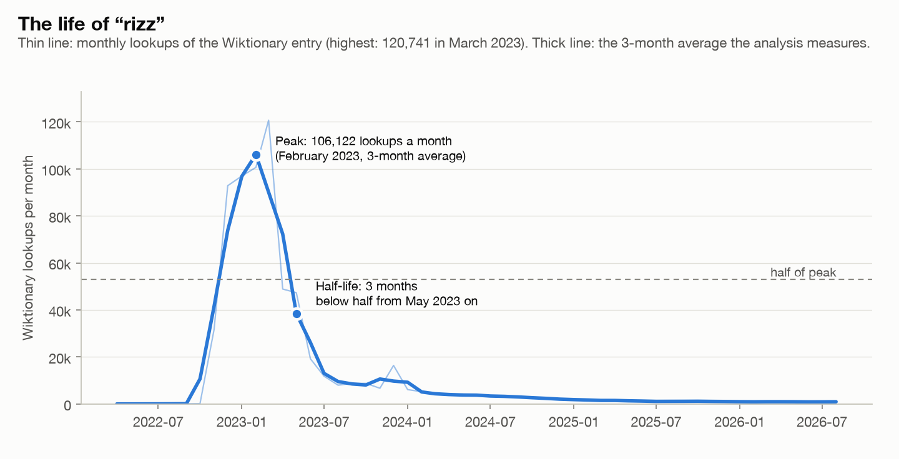
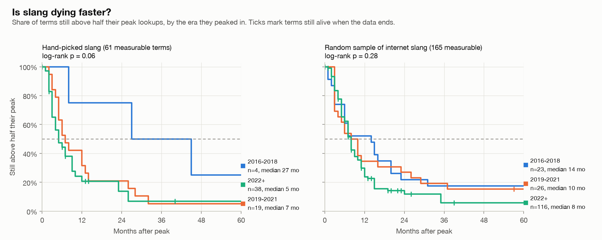
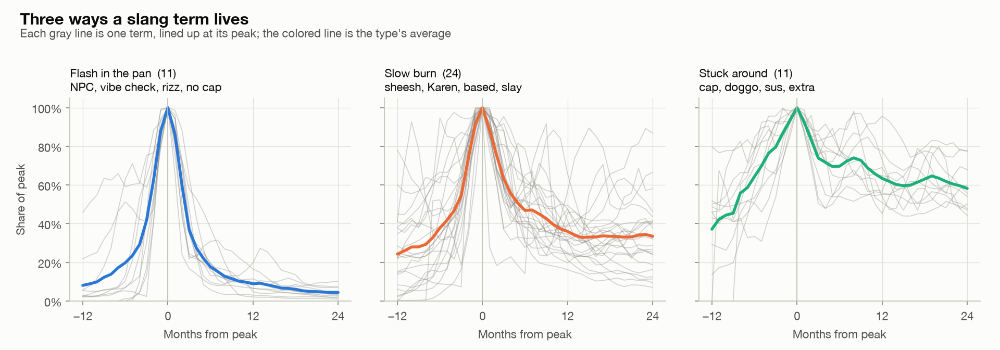
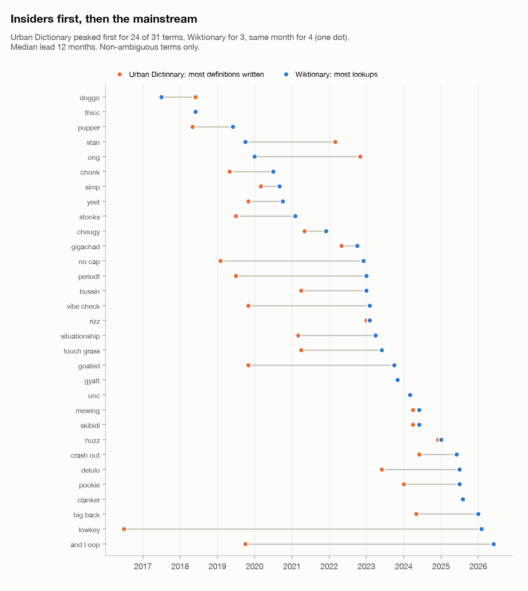

# Slang Half-Life — how long does a slang term live?

[](https://www.python.org/)
[](LICENSE)

In March 2023, the Wiktionary entry for **rizz** was looked up 120,741 times. Within
three months its lookups had halved, and today they sit at about 1% of the peak.
That's a whole life cycle (rise, peak, fade) in one word.

This project measures that cycle for 77 slang terms from 2016 onward, using ten
years of Wiktionary lookups and 10,261 Urban Dictionary definitions, and asks three
questions:

1. **Is slang dying faster than it used to?**
2. **What shapes do slang lives take?**
3. **Do insiders get there first?** Does a word peak on Urban Dictionary before the
   mainstream looks it up?

> **The finding in one line:** slang *feels* like it's dying faster, and in every
> version of the analysis older terms lasted longer, but the evidence for a real
> speed-up is weak. What holds up strongly is the third question: the people who
> use a word write it up on Urban Dictionary, typically 6 to 12 months before the
> mainstream looks it up.



## 1. Is slang dying faster?

A term's **half-life** is how many months it takes, after its peak, to fall to half
its peak lookups *and stay there* for three months. Some terms haven't fallen that
far yet. Dropping them would bias the answer, because they're mostly recent terms and
slow faders, so the newest eras would look faster than they are. Instead, **survival
analysis** (Kaplan-Meier curves and a log-rank test) counts them as "survived at
least this long."



```
Is slang dying faster?                               median half-life   log-rank
  hand-picked, grouped by the year each term peaked    27 / 7 / 5 months   p = 0.06
  hand-picked, grouped by the year it took off         12 / 5 / 6 months   p = 0.82
  hand-picked, no ambiguous words (peak year)            8 / 5 / 5 months   p = 0.83
  hand-picked, no ambiguous words (takeoff year)        12 / 3 / 5 months   p = 0.007
  random sample of 400 internet-slang entries           14 / 10 / 8 months  p = 0.28
                                               (eras: 2016-2018 / 2019-2021 / 2022+)
```

Every version puts the 2016–2018 terms on top: older slang lasted longer. But only
one version reaches significance, and it doesn't show a steady speed-up: its fastest
era is 2019–2021, not the newest. It's also one of five ways of slicing the same
question, so one small p-value among them is less surprising than it looks on its
own. The earliest era is thin, too: the pageview data starts in mid-2015, and many
2016–2018 terms kept growing and peaked later (*yeet* peaked in 2020).

So the honest answer is: **probably not in a way this data can confirm.** I set the
tests up before seeing their results and didn't go looking for a version that came
out significant. Trying things until one works is the same trap my
[honest-backtester](https://github.com/GalacticChill/honest-backtester) is built to
catch.

## 2. Three ways a slang term lives

Line every term's curve up at its peak, scale the peak to 1, and cluster the
shapes (Ward clustering into three groups, a number fixed in advance):



```
Shape types               share of peak: 3 months after   24 months after
  flash in the pan  11 terms                      37%                4%
  slow burn         24 terms                      63%               33%
  stuck around      11 terms                      74%               58%
```

- **Flash in the pan:** *rizz, skibidi, gyatt, brain rot, simp, stonks, no cap,
  touch grass, vibe check*. These terms shot up and collapsed just as fast. Nine of
  the eleven peaked in 2022 or later. That pattern holds for my hand-picked list,
  but **not** for the random sample, where recent terms were no more likely to
  collapse fast. So "recent slang burns out fastest" describes the famous viral
  words, not internet slang in general.
- **Stuck around:** at first this group was mostly ambiguous words (*cap, bet,
  extra*), whose lasting lookups probably come from their ordinary meaning. Rerun
  without ambiguous words, the type still appears: *doggo, situationship, unalive,
  big mood, chonk, thicc, stan, unc*. Some slang really does settle into the
  language.
- **The types blur into each other.** The clusters are only loosely separated
  (silhouette score 0.26, where 1 would mean perfectly separate). Think of them as
  three regions of a spectrum from fast to slow, not three sharp species.

## 3. Insiders first, then the mainstream

Urban Dictionary definitions are written by people who already use a word;
Wiktionary lookups come from people who've just run into it. For each term, compare
the month the most definitions were written with the month of peak lookups:



```
Urban Dictionary vs Wiktionary peaks     UD first   Wiktionary first   median lead
  all terms                                 37             11          6 months   p = 0.0002
  non-ambiguous terms                       24              3         12 months   p < 0.0001
  adjusted for Urban Dictionary activity    34             14          5 months   p = 0.006
```

(Same-month peaks are left out of the counts. The p-values come from a sign test.)

This is the strongest result in the project. It survives removing ambiguous words
(it gets *stronger*) and adjusting for Urban Dictionary getting less active over the
years. The gap varies a lot:

- **Recent viral terms hit both at once:** *rizz* 1 month, *skibidi* 2, *gyatt* 0.
- **Some terms were defined years before the mainstream noticed:** *bussin*
  (21 months), *delulu* (25), and longest of all *lowkey* and *snatched*, at over
  nine years. These come from Black American slang, and the data backs up something
  often said about "Gen-Z slang": much of it is older Black slang reaching a wider
  audience.
- **The exceptions are ambiguous words** (*ratio, cap, stan, mid*), where the
  definitions mix in the ordinary meaning.

## How the data works

- **Terms.** 77 hand-picked terms that took off in 2016 or later, each with its own
  Wiktionary entry ([`data/terms.csv`](data/terms.csv)). The rules were fixed before
  looking at any lookup counts. 27 are flagged **ambiguous** because their page also
  covers a common non-slang meaning (*cap*, *lit*, *sigma*).
- **Lookups.** Daily human pageviews from the Wikimedia API, July 2015 onward, added
  up into months.
- **Spelling variants are merged.** Wiktionary gives variants their own pages instead
  of redirects, and a lookup only counts for the page the reader lands on. *OK boomer*
  had 413 lookups on its main page, but thousands more on *"OK, boomer"*. Variants
  were found automatically, then hand-checked so only spellings of the *slang*
  meaning count (*karen* yes, *Karin* no).
- **Short bursts are filtered.** On 25–26 August 2022, the pages for *"OK, boomer"*,
  *bussin* and *goated* each got thousands of lookups in two days while the rest of
  Wiktionary was quiet: a link or a bot, not a word spreading. Each day is capped at
  10 times the median of the four weeks around it. For the typical term this removes
  0% of lookups.
- **Site traffic is normalized.** Wiktionary's own traffic doubled between 2016 and
  2025, so lookups are measured per million Wiktionary pageviews. This moves the peak
  month for 20 of the 77 terms (*chonk* peaks in 2020, not 2023).
- **Months before a page existed are left out,** not counted as zero interest.
- **Minimum size.** A term needs a peak of at least 200 lookups a month (3-month
  average) to be measured, and its peak can't sit at the very start of the data,
  where the real peak may have come earlier. 61 of the 77 terms qualify.

## Reading the results honestly

- **Lookups aren't usage.** People look up words they don't know. A phrase whose
  meaning is obvious gets few lookups however popular it is: even *boomer* peaked at
  about 1,500 a month in late 2019.
- **Only terms with a Wiktionary entry count.** Wiktionary won't create an entry until
  a word has documented real-world use, so the newest slang (*6-7*, *fanum tax*) isn't
  here yet, and every term in the study is one that lasted long enough to be recorded.
- **The data starts in July 2015,** so the 2016–2018 era is thin, and terms whose pages
  were created after their peak can't be measured (*OK boomer*'s pages date from
  March 2020, after its moment).
- **The burst filter also removes real news spikes.** *stonks* loses four days during
  the GameStop short squeeze in January 2021. This project measures *sustained*
  popularity, not news moments.
- **Ambiguous words mix meanings,** which is why every headline is rerun without them.
- **Urban Dictionary's API is unofficial.** Only exact matches are used, stray old
  definitions with other meanings are handled by measuring onset as the month 10% of
  all definitions had been written, and a snapshot of definition IDs and dates (no
  text) ships with the repo.
- **The hand-picked list is my judgment.** The random sample of 400 entries from
  Wiktionary's *English internet slang* category checks that the results don't
  depend on it.

## Install & run

```bash
pip install -e .
slang-half-life            # or: python -m slang_half_life
```

This prints every number above from the data that ships with the repo and redraws
the charts in `assets/`. No network needed.

```bash
slang-half-life --collect         # re-download Wiktionary data (a few minutes)
slang-half-life --collect-urban   # re-download Urban Dictionary dates (~30 minutes)
slang-half-life --check-terms     # check every term still has a Wiktionary entry
```

## What's inside

- `terms.py`: the term list, its rules, and live entry checks
- `collect.py`: daily Wikimedia pageviews, burst filtering, spelling variants
- `normalize.py`: site-traffic normalization and entry creation dates
- `lifecycle.py`: peak, rise time, half-life (with still-alive terms), stickiness
- `survival.py`: Kaplan-Meier curves and a k-group log-rank test
- `shapes.py`: peak-aligned curves, Ward clustering, rule-based type names
- `urban.py`: Urban Dictionary definition dates, onset, peak lead, sign test
- `robustness.py`: the no-ambiguous-words rerun and the random category sample
- `report.py`, `plots.py`, `cli.py`: the report, the charts, the command line

## Tests

```bash
pytest
```

All 68 tests run offline. Most check a known answer: half-lives recovered exactly
from synthetic curves, a hand-worked Kaplan-Meier example, the log-rank test
matching SciPy's, planted shape types recovered and correctly named, a two-day burst
clipped while a real rise is left alone, and a dropped connection resumed without
re-downloading. The last test runs the full report on the shipped data.

## Data

- **Wiktionary lookups:** [Wikimedia pageview API](https://doc.wikimedia.org/generated-data-platform/aqs/analytics-api/)
  (no key needed). Snapshots: `data/pageviews.csv`, `data/totals.csv`,
  `data/created.csv`, and `data/sample_*.csv` for the random sample.
- **Urban Dictionary:** the unofficial `api.urbandictionary.com/v0` endpoint,
  queried at one request a second. Snapshot: `data/urban_definitions.csv`
  (definition IDs and dates only).

Data runs through August 2026.
